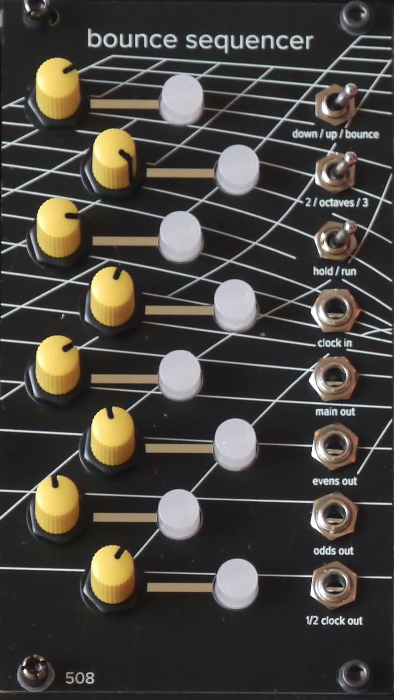

# Bounce Sequencer

An 8-step sequencer with a pushbutton interface. Toggle switch selects up / down / or bounce mode. In up or down mode, pushing any two buttons will cause the sequencer to skip the steps between them (either between them on the inside, or between them on the outside, depending).

In bounce mode, any lit button will cause the sequencer to reverse direction when it hits it.

There's a toggle to select ~2 octave or ~3 octave range, and a hold/run toggle.

In addition to the main clock input and the main sequence CV output, there are three additional outputs:

- CV from odd-numbered steps only
- CV from even-numbered steps only
- a one-half division of the clock

There is an expansion bus on the back for driving the optional 8-step trigger sequencer.

